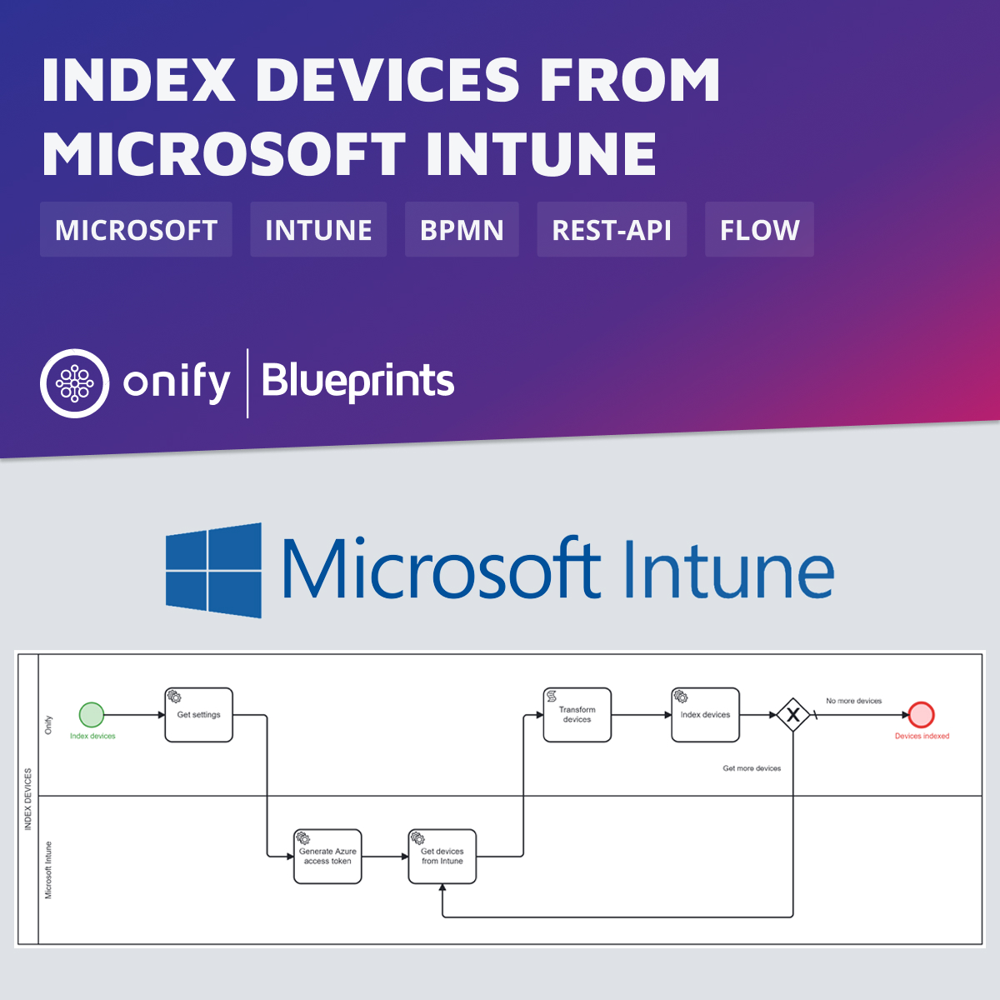

# Onify Blueprint: Index devices from Microsoft Intune

...

In this Blueprint we show how we can index devices from Microsoft Intune using Graph API integration.

## Requirements

* [Onify Hub](https://github.com/onify/install)
* [Camunda Modeler](https://camunda.com/download/modeler/)
* [Dynamics 365 Sales](https://dynamics.microsoft.com/sales/overview/)

## Included

* 1 x Flow

## Setup

### Microsoft

You need to create a app for this so we can access Graph API and list devices from Microsoft Intune.

### Onify

Add the following settings.

|Key|Name|Value|Type|Tag|Role|
|---|----|-----|----|---|----|
...

> Note: Creating settings via admin interface add a trailing `_` in key. This is required for flow to work.

## Test

1. Open the BPMN diagram in Camunda Modeler.
2. Deploy the BPMN diagram (click `Deploy current diagram` and follow the steps).
3. Run it (click `Start current diagram`).

## Support

* Community/forum: https://support.onify.co/discuss
* Documentation: https://support.onify.co/docs
* Support and SLA: https://support.onify.co/docs/get-support

## License

This project is licensed under the MIT License - see the [LICENSE](LICENSE) file for details.